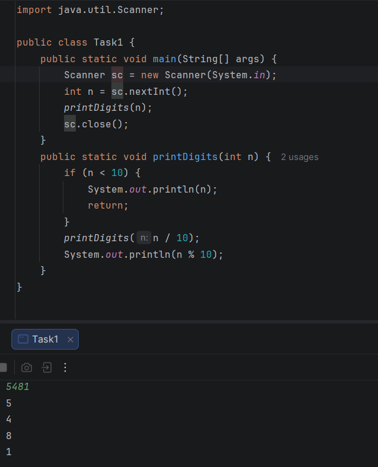
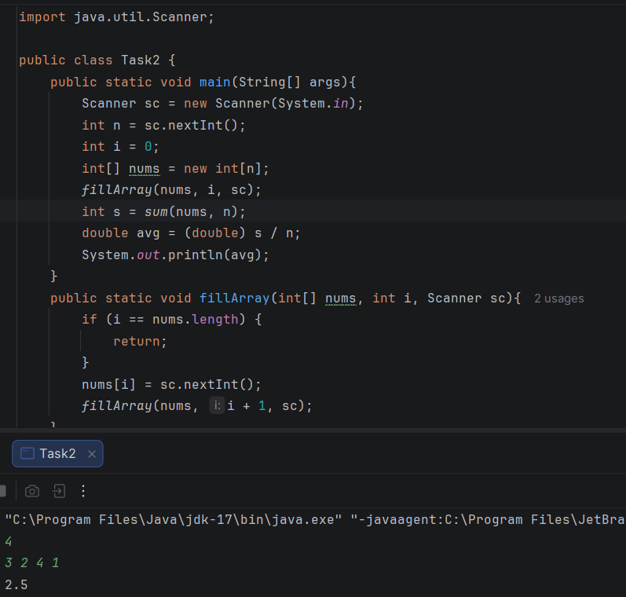
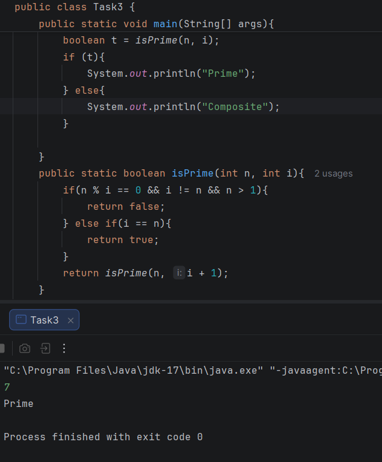
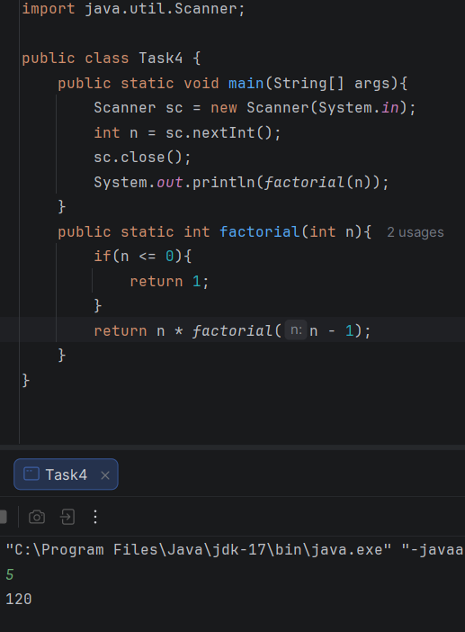
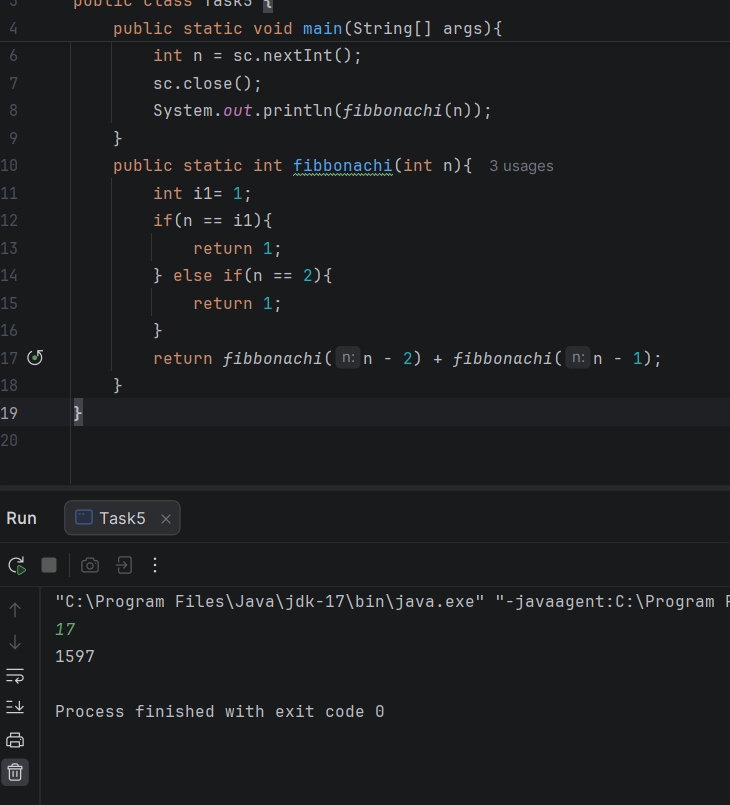
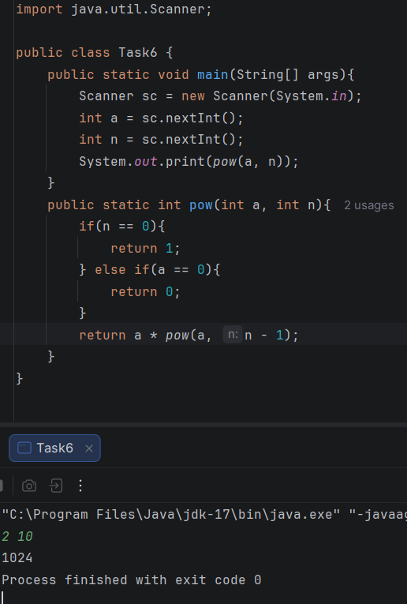
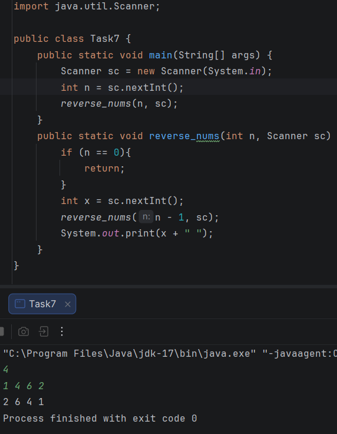
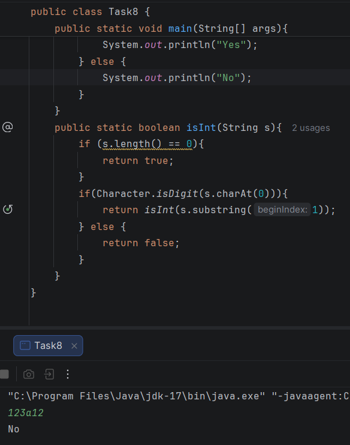
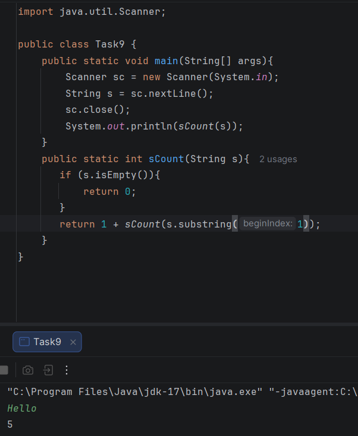
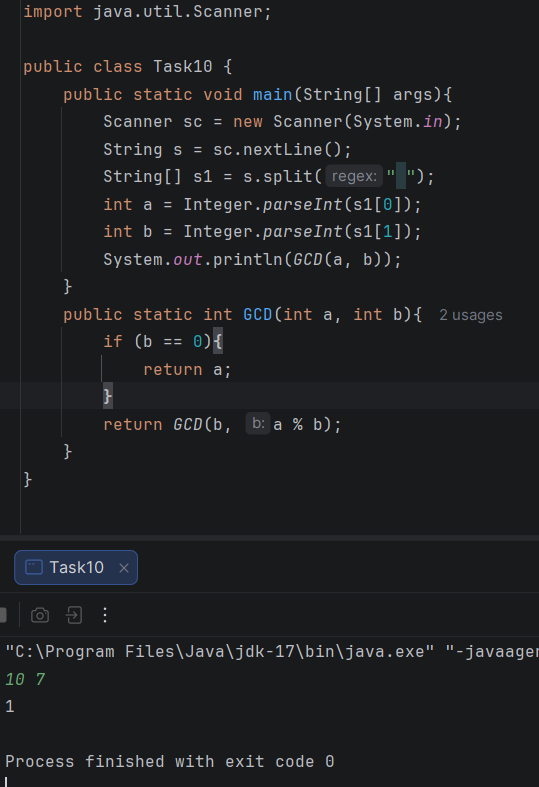

<h2 align="center">ADS | Assignment #1 Recursion</h2>

<b>Name: Sergeyev Zhansir</b>

<b>SE-2512</b>

<h3 align="center">Part 1. Recursion with Numbers</h3>

<b>Task # 1: Print Digits of a Number</b>

Print Digits of a Number
Write a recursive function that takes an integer as input and
prints every digit of the given number on a separate line.

 

<b>Task # 2: Average of Elements</b>

Write a recursive function to calculate the sum of the
elements, then compute the average using the result.

 

<b>Task # 3: Prime Number Check</b>

Write a recursive function that checks whether a number n is
prime. A prime number is a number that is divisible only by 1 and
itself.

 

<b>Task # 4: Factorial</b>

Write a recursive function that calculates n!.

 

<h3 align="center">Part 2. Recursion with Sequences</h3>

<b>Task # 5: Fibonacci Number</b>

Write a recursive function to find the n-th Fibonacci number. 

 

<b>Task # 6: Power Function</b>

You are given numbers a and n. Write a recursive function that
returns: an

 

<b>Task # 7: Reverse Output</b>

You are given n numbers. Write a recursive function that reads
and prints the numbers in reverse order without using another
array.

 

<h3 align="center">Part 3. Recursion with Strings</h3>

<b>Task # 8: Check Digits in String</b>

You are given a string s. Write a recursive function that
checks whether the string contains only digits. Return "Yes" if
all characters are digits, otherwise return "No".

 

<b>Task # 9: Count Characters in a String</b>

Write a recursive function that counts the number of characters in a
given string. The function should return the total number of characters
in the string.

 

<b>Task # 10: Greatest Common Divisor (GCD)</b>

Write a recursive function that finds the GCD of two numbers
using the Euclidean Algorithm.

 

<h2 align="center">Summary</h3>

<b>This assignment was completed using Java. The tasks focus on mastering recursion, improving algorithmic logic, and working with core elements like strings, arrays, and numbers. The standard java.util.Scanner class was utilized to handle user input.
</b>

